Last weekend, I decided to do two free tours in one day! Initially I thought I would skip the free walking tour, as it seems like the kind of thing you'd do to cram in all of the sights in a short trip, and luckily for me I have 4 weeks in Sofia. But, one of my coworkers said he always takes visitors on this tour and that it was worth doing, so I decided to go. 

The tour started off at the city court. So, I caught the metro to Serdica and walked there. All this metro taking is getting me very excited for the CRL. Also - a tip I discovered today! On iPhones, if you go to Settings->Wallet->Express Transit Card, you can choose a card to use as your 'express' card. That means you just tap it on the scanner, no face ID, touch ID, or turning on the screen needed. Here is a picture of the city court with one of the old trams going past:

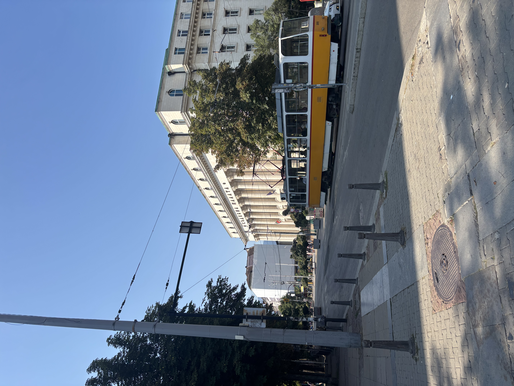

Then we started with introductions. The guide asked us to give our national animal and the country we were from. Most people were from Romania, Poland, and Germany. When it got to me, I said "Our national animal is a kiwi, so I don't think I need to tell you which country I'm from". The guide seriously thought I was from Australia! After I corrected him we moved onto the next couple. They said kangaroo, and everyone laughed. I talked to them later, they are actually from Ireland but had been living in Australia for the last 10 years. They totally had Australian accents though! 

The first stop was the statue of Saint Sofia. A bit of controversy as the church doesn't think this statue represents a saint. #lame

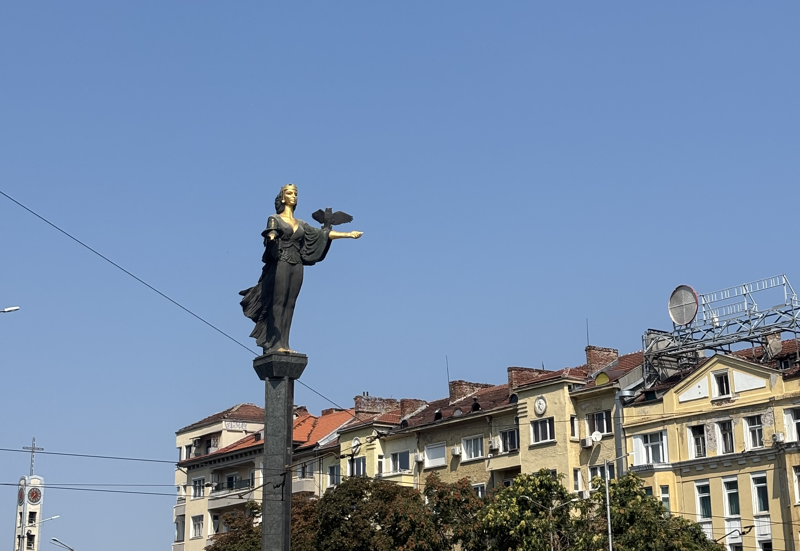

There were a few more stops around some of the old Roman ruins around the Serdica station (Serdica is an old name for the city), which I had already seen. These are pretty cool, but it seems like people don't know that much about them so the only interesting thing is that beneath Sofia, there are layers of ruins from all the different empires that inhabited the area over the last 7000 years. Then we moved onto the public bath houses. Outside, there are hot spring taps that were all busy with people filling up huge jugs of water. I will never understand the collecting special water and carting it across the city thing. I never even tried the water from the Speights tap in Dunedin... 
The bath houses had some pretty cool detail though:

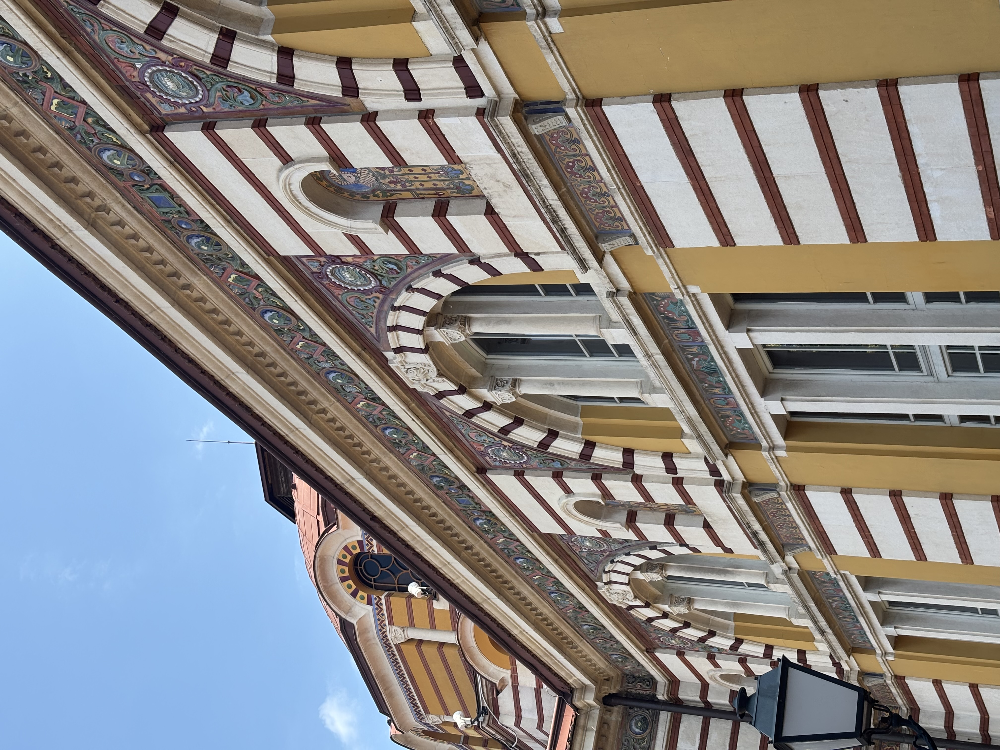

After that we moved to the presidential residence (I think). It was quite hard to hear what the guide was saying a lot of the time, but he did make a lot of jokes about casinos and McDonald's throughout the tour. It seems like it's quite normal in Europe to have both a president and a prime minister. When people ask me what we have in New Zealand, I tell them we have a CEO. Bulgaria has had 8 parlimentary elections in the last 5 years. Apparently this is because most parties get around 20% of the vote and then refuse to work with each other to get to a 50% majority... interesting...
There were actual guards though, which was a bit freaky. Inside, there was this nice old building & garden, which I did not get the backstory about from the guide, sorry. 

| | |
|-|-|
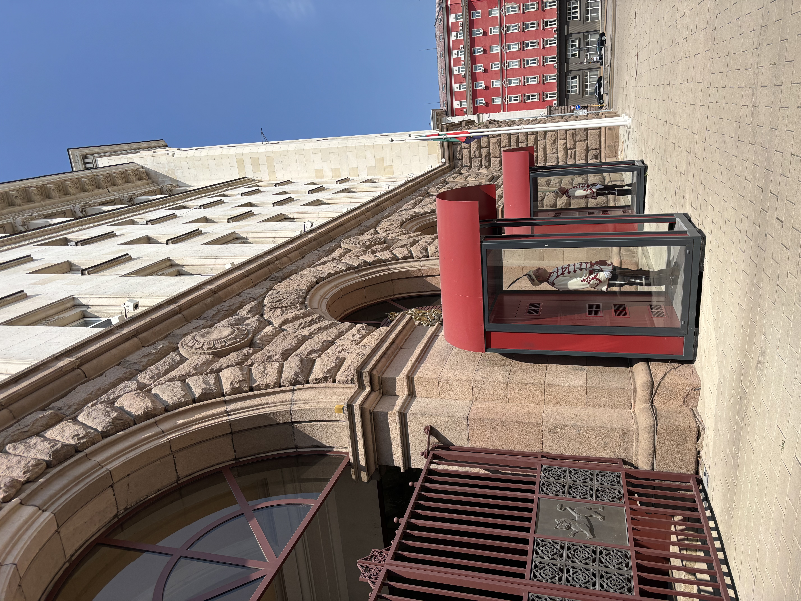|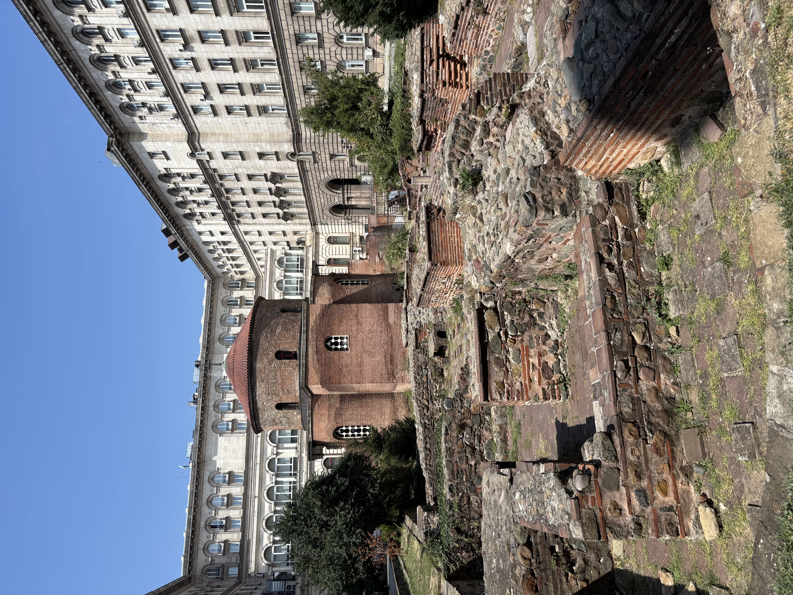

The rest of the tour was stopping at different churches and things, which were cool, but I had seen a lot of them already. I tipped the guide, made a quick stop at Lidl for a cool drink, then headed to the meeting point for the Balkan Bites tour. Overall this tour was ok. It was a quite long and a little boring, but I think it would be worth doing as a first activity if you're not in Sofia for long. Maybe it would be better with a smaller group. 

The Balkan Bites tour was great! There were only about 10 of us which was a perfect sized group. One of the people in the group was actually from Sofia as well so it was kind of like we had two tour guides. We started at a Sri Lankan restaurant to try some bean patties/sausages with a Bulgarian yogurt sauce. Goooood. 

After that was a wine shop to try some Bulgarian wine. Also goooood. Then we went to a toast place to try Lyutenitsa. Lyutenitsa is a tomatoey savoury spread that is one of my biggest difficulties with Bulgaria. Sometimes, it is really good and I think I should get a jar from the supermarket. Then the other 50% of the time it has capsicum in it. There is no way to tell. I was really brave and tried it and this one was good. Plus it had some green garlic salt stuff that was awesome. 

The next stop was a bakery for Mekitsa, which is kind of like fry bread. Can't go wrong! We finished at a traditional Bulgarian restaurant for some bread with different spreads on them, and some Bulgarian red wine. There was Lyutenitsa here too, and this one was not good. Good thing we had the red wine. This restaurant also had very impressive ceilings. 

| | |
|-|-|
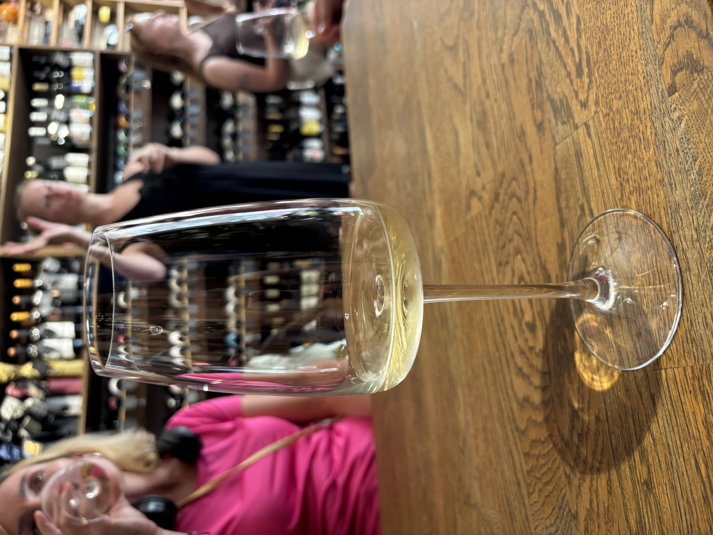|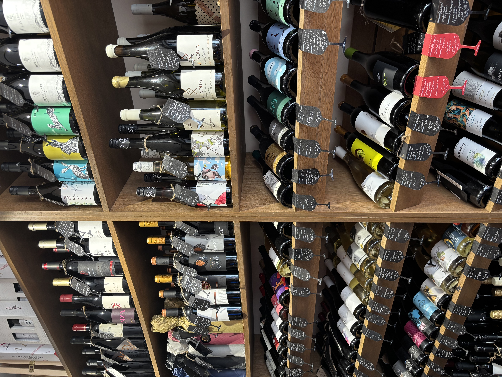
|   | |
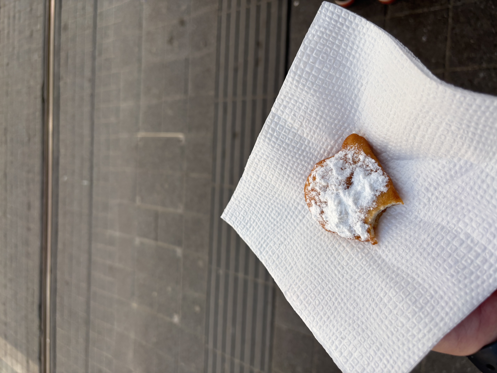|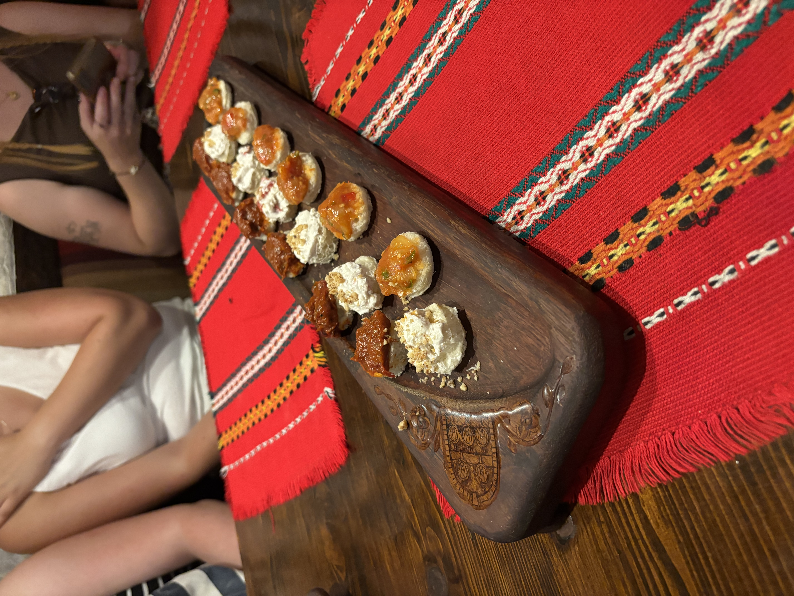
|   | |
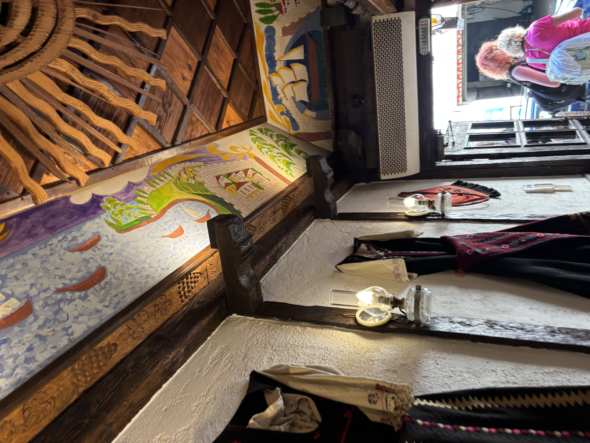|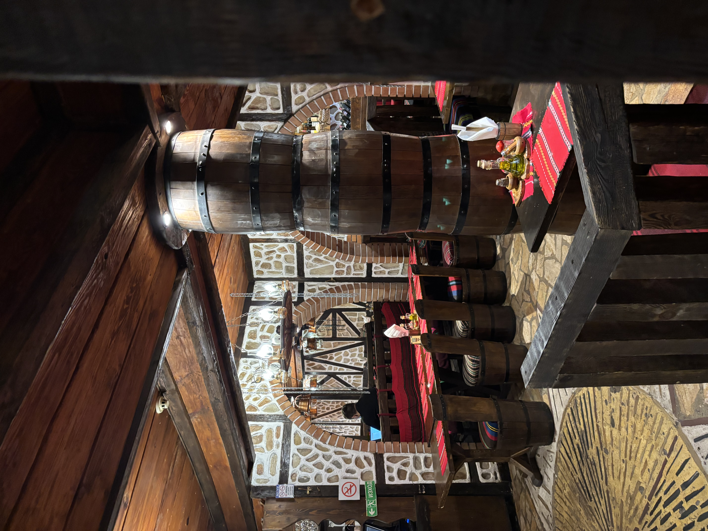

After the tour, me and 3 other girls decided to have a proper lunch/dinner at a restaurant the guide recommended. I got tarator (Bulgarian cold yogurt, dill & cucumber soup) with some bread. I wasn't sure if I was gonna like it but it was pretty good! I met up with some of them again later for some drinks too, and we found this cool bar where you could sit in the window and watch the people on the street. 

| | |
|-|-|
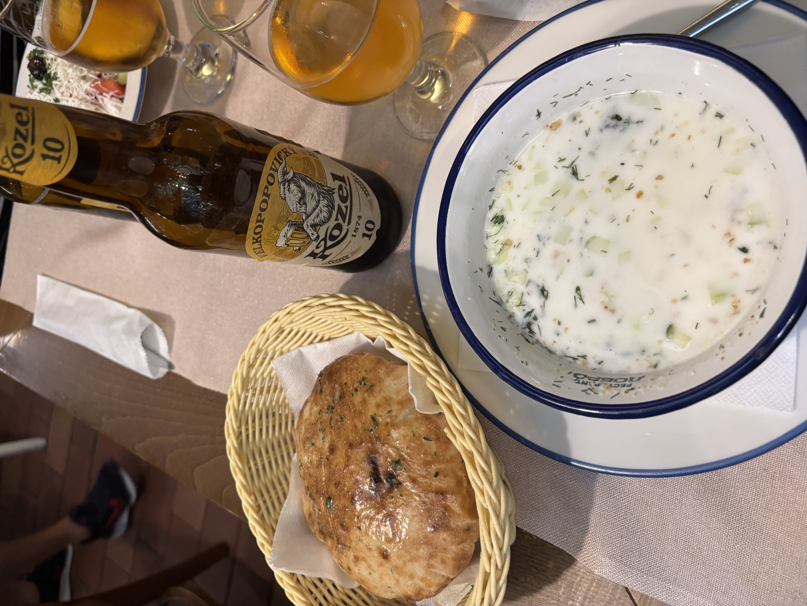|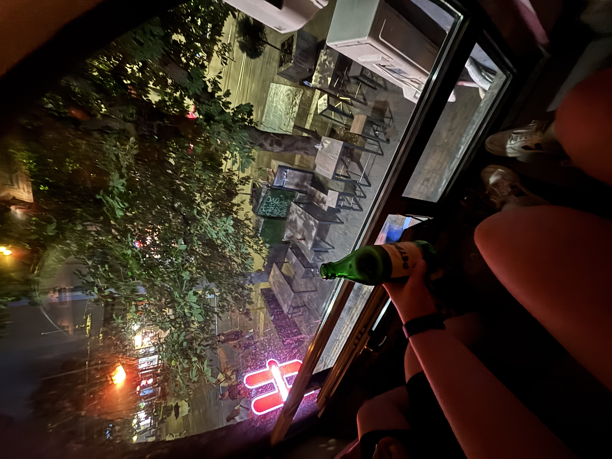

I would definitely recommend the Balkan Bites tour if you are in Sofia. Apparently they also have a free food tour in Prague, so maybe I will check that one out too!