It's time to go back to the Bulgaria content. The supermarkets in Bulgaria were pretty impressive, especially the bakery sections. My favourite supermarket chain I think was Billa, but I think Lidl had the best bakery section. I only went to Kaufland once and you will see, it is not fair to rank it against the others. 

| | |
|-|-|
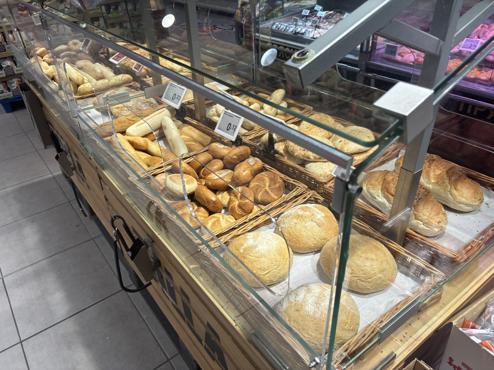|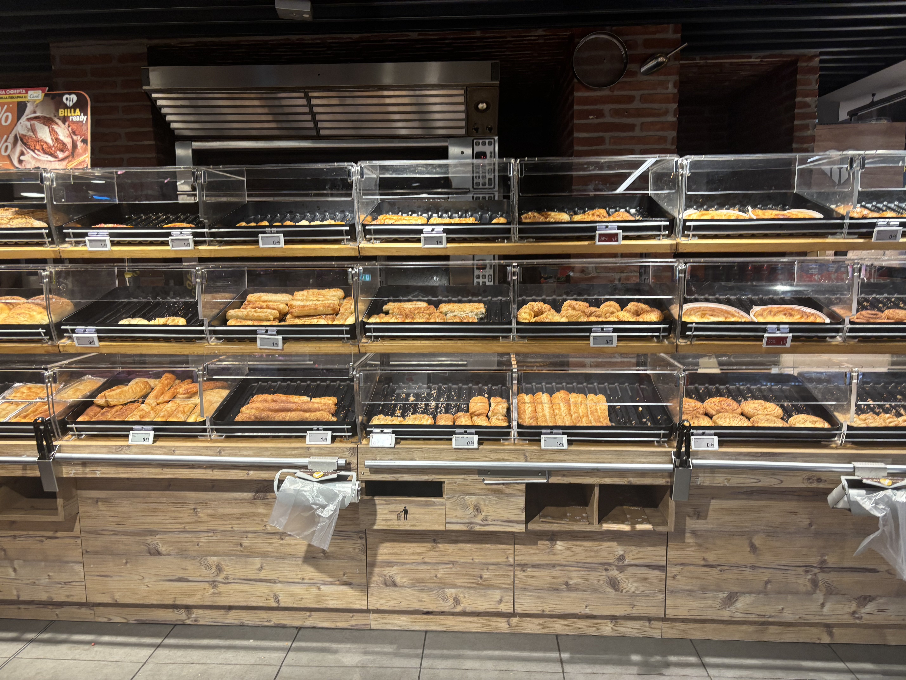

Probably the best section of any supermarket is the bakery, but in Bulgaria the bakery section is even better. Everything is warm, nothing is really more than €1. It's mostly pastries filled with cheese similar to feta shaped in many different ways. This is called Banitsa, and it was what I had for breakfast for pretty much my whole first week here. There are also quite a lot of donuts, but they are all filled with stuff. Even the ones with holes are filled. 
 
A lot of the pictures I've taken of the bakery section is to either remember the name of something I'm getting so that I can put it into the self checkout later, or to translate the name so that I know what it is. 
  
Another thing to note is that most of time there are no tongs for the bakery. Just a bunch of plastic gloves so you can squish the bread to check how fresh it is. I don't like this system.

| | |
|-|-|
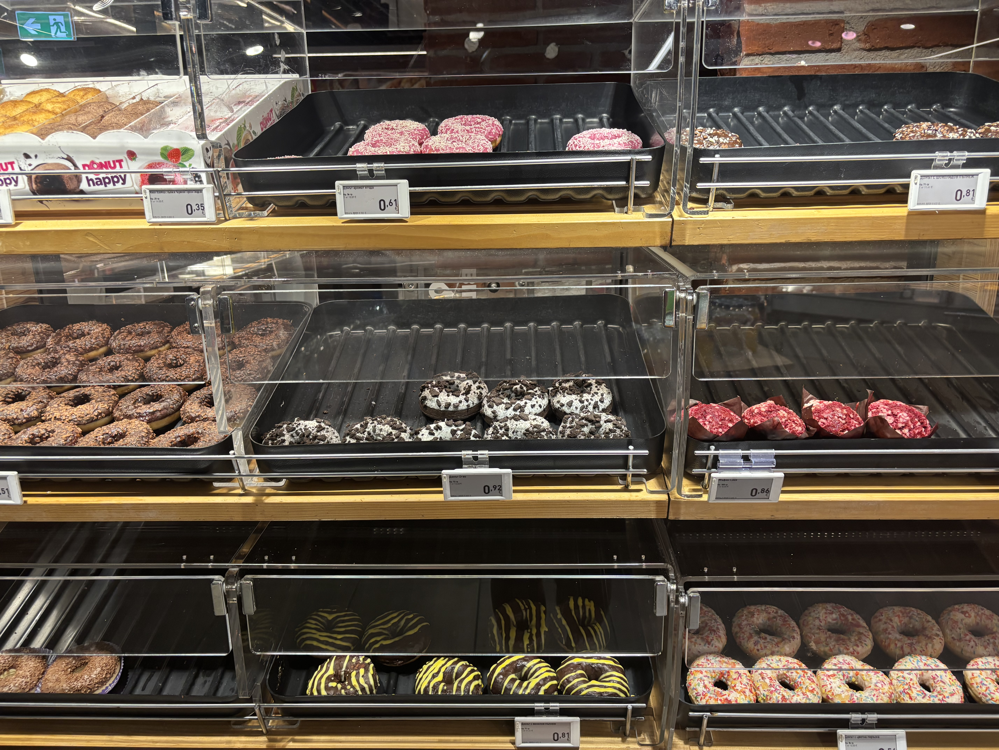|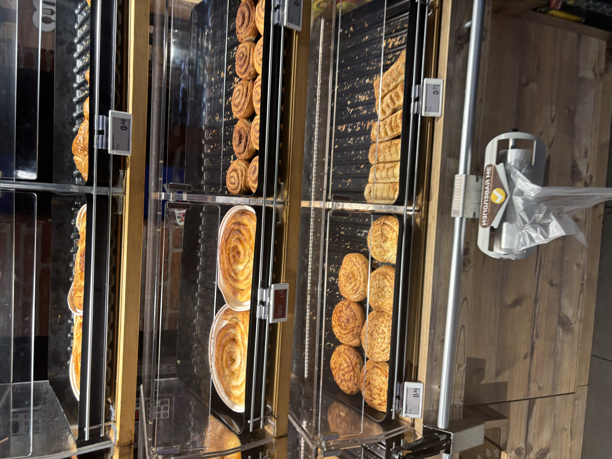

The fruit & vegetable section is not always that good. Most people go to markets or fruit and vegetable stalls, so I don't think it is as fresh in the supermarket. There were HUGE watermelons in nearly every supermarket though. Hand for scale. 
 
One of my coworkers brought me a tomato from his relative's garden so that I could try a proper Bulgarian tomato. He did suggest I go to stall at first, and look for something called... then he said "Oh that's right, you can't read". The tomatoes are soooo good though, as I mentioned in my last post. 

| | |
|-|-|
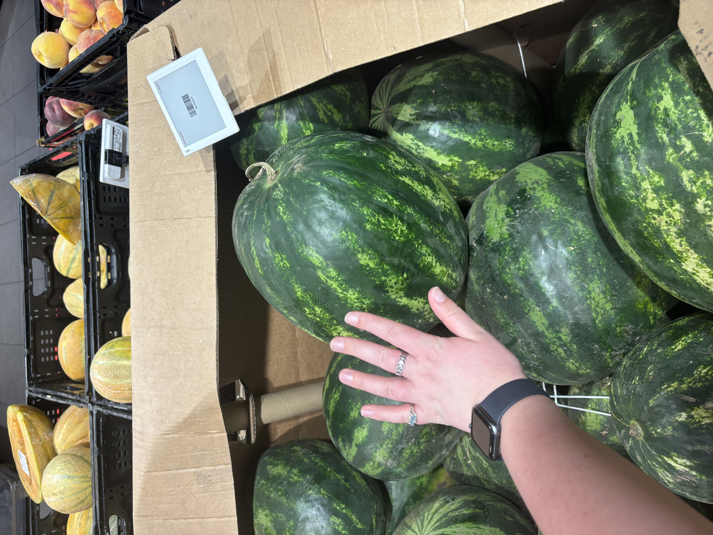|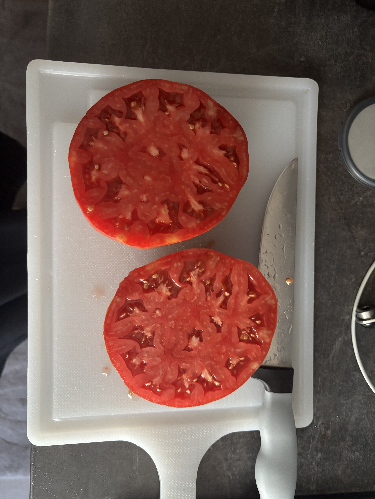

The fruit might not be that fresh, so you might want to get some juice instead. Luckily there are soooo many different types on juice. My favourite was probably peach juice, even though I don't like peach flavour that much. Something about the texture was really good. There was also ...banana juice? I didn't try this. 

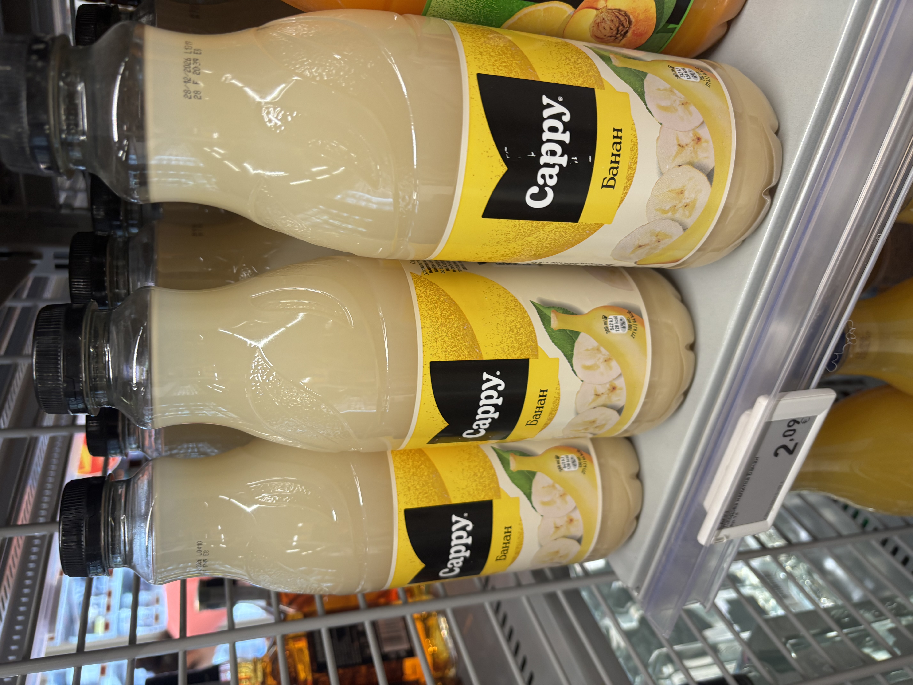

Alcohol is very cheap in most of Europe it seems like. The rules are also a lot less strict, you can drink in parks, buy vodka from the supermarket etc. The strangest thing to me was that the convenience stores (I think they might call it 'non-stop' here) are mostly for coffee, alcohol, and cigarettes. I was arriving late one day and wanted to grab some milk, but these don't even sell milk. 
 
Because there aren't strict rules on what you can buy in the supermarket, it means that you can get 3x pre mixed Aperol spritz for only €1.99!

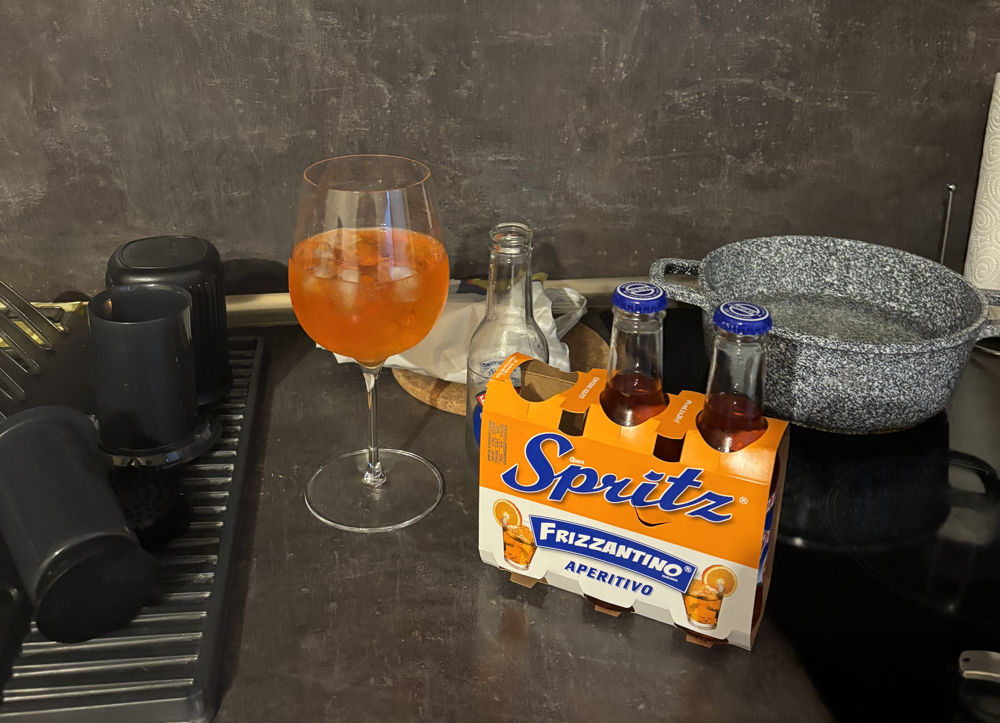

Bulgarian yogurt is a real thing. I wanted to go the yogurt museum but it was a 2hr bus ride, so maybe next time. In most of the world it seems like we have Greek yogurt, but apparently in Japan they have Bulgarian yogurt. I don't really know the full story but something about the grass in Bulgaria makes good yogurt. 
 
The yogurt is pretty good. Super thick! It was much better than the yogurt options in Germany (speise quark?). There are no flavours though, just different fat percentages. There are sometimes a couple of options with fruit of thin pieces of chocolate mixed in. My only gripe with it is that there is no good way to close the container after opening.

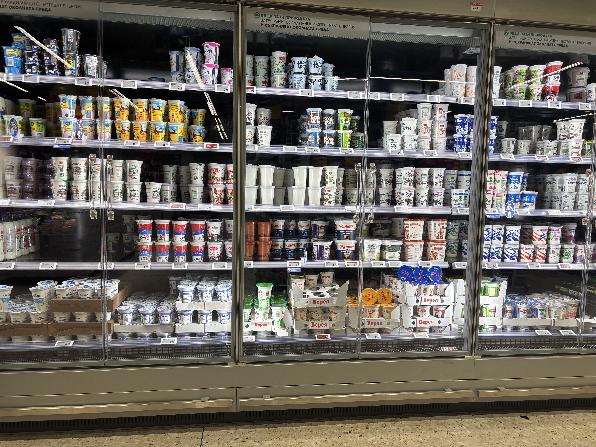

A big issue I've run into twice now is the amount of fabric softener available in supermarkets. Almost the WHOLE laundry aisle is fabric softener. Plus it's hard to translate stuff like 'fabric softener' vs 'laundry detergent'. This happened in Germany too. When I finally found the actual washing powder/liquid, I could only find it in huge tubs. 

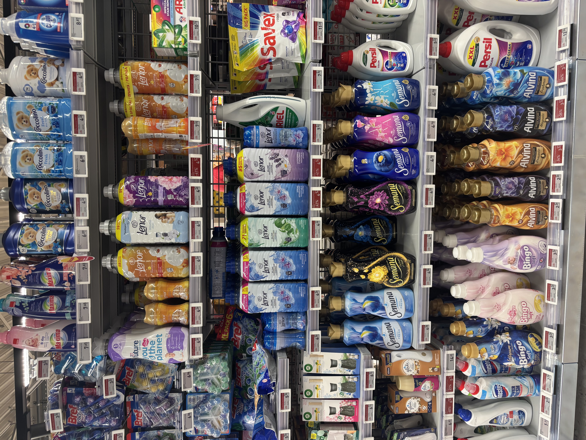

In the city, there is quite a grand building near the Serdica train station. You'd never think there was a supermarket inside, but there is! A huge and beautiful Kaufland. There is even a fountain in the middle. This is worth a visit I think if you're in Sofia, plus the bakery is great. 

| | |
|-|-|
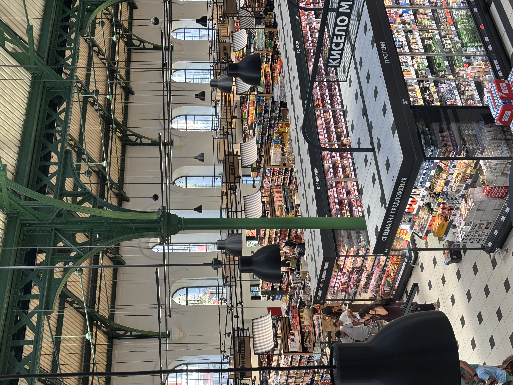|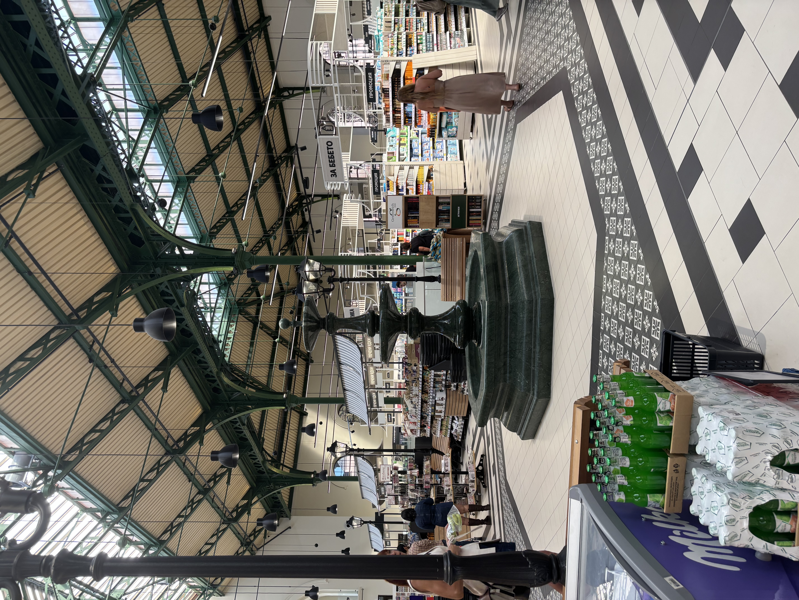

The supermarkets in Sofia were awesome, especially when comparing to Germany. I found something new everytime I went, and they had lots of the stuff I eat every day like yogurt and muesli (side note - why does all the muesli have chocolate in it here?). I will miss being able to buy pre mixed Aperol spritz at the supermarket. 