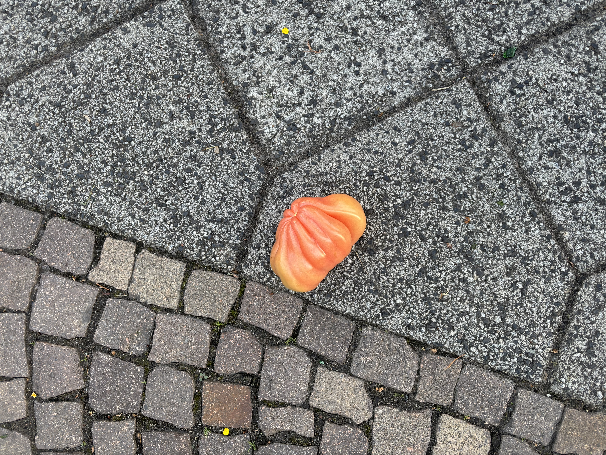
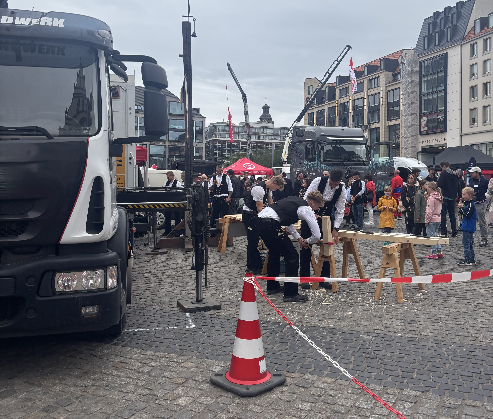
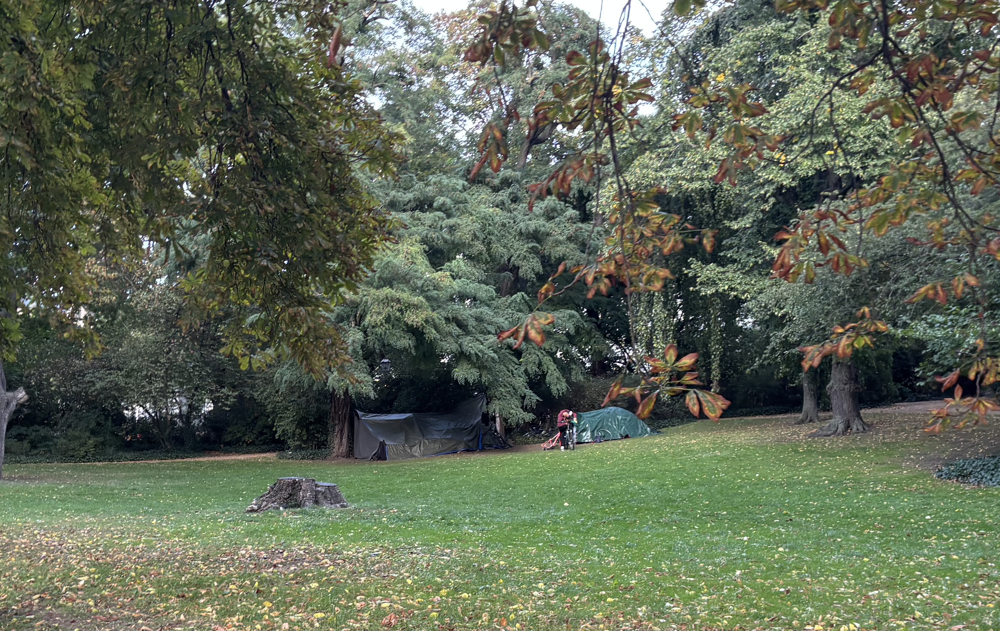
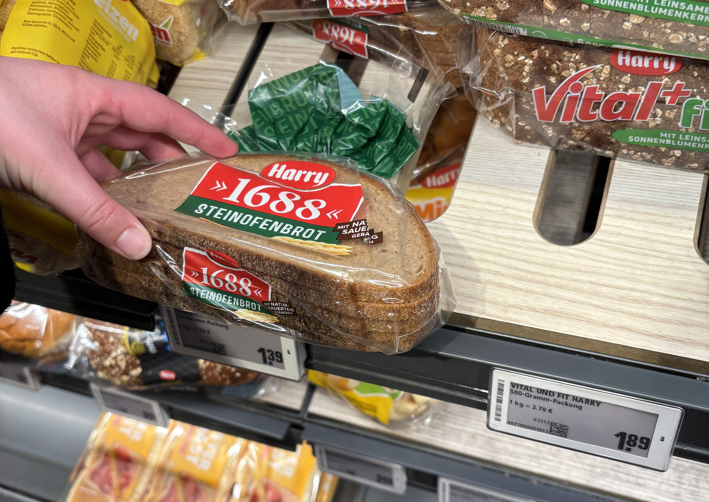
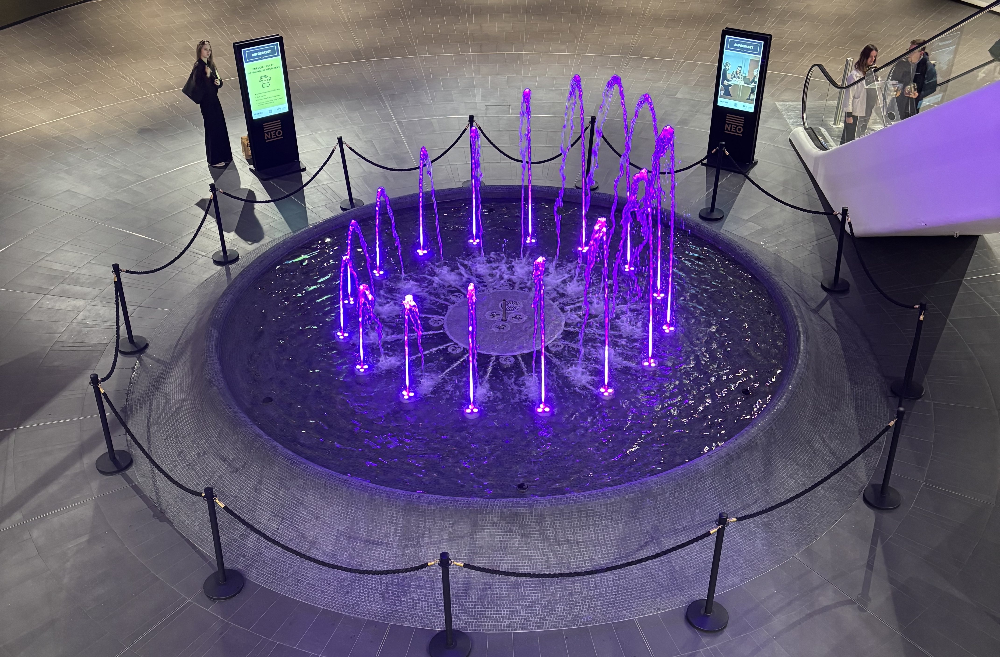

I'm in Leipzig now! No blogs for a while sorry about that. I still have one or two more about Sofia/Greece that I will do later, but I wanted to do one about Leipzig while I was still in Leipzig. 

Leipzig is quite a cool little city. It has a similar population to Christchurch but is smaller, so it feels busy. It's a university city with gothic style buildings and crispy cold days, so it feels quite a lot like Dunedin too. Lots of people with lanyards. Here are some things I've seen in Leipzig:

### Mett Brötchen

Every Tuesday at the office there is "Mett Tuesday". This is when someone brings raw pork mince, raw onion, and bread rolls from the market to the office so that everyone can have mett brötchen. Everyone in the office is very grateful for Mett Tuesday. It took me a week to build up to courage to try the raw pork but it was pretty good! Especially with pickles. 

### Pfand 

If you check your receipts in Germany, you'll notice that there'll be some extra charges of €0.25. This is charged for every plastic bottle, can, and sometimes glass bottles too. You can hold onto the empties and take them back to the supermarket, put them in the machine, and you'll get your €0.25 back as a voucher to use at the supermarket. If you can't take it back, then you can leave it next to a bin and a homeless person will cash it in on your behalf. Good system! It's fun to put stuff in a machine and watch the balance go up. 

### Supermarket robot

Another supermarket thing! There are these robots in the supermarkets. I don't know what they are for, they carry stuff but who unloads it?. Maybe they clean too? But mostly dancing. Sometimes they just stop in the aisle and play music and spin around with confetti on the screen. 

### Speaker guy

Of course in NZ we have people who walk around with speakers. It's kind of cool to me. But in Leipzig, the people who walk around with speakers have much more serious speakers, and the music is much louder, but it's more suitable walking music. The noise pollution here is generally better. The buskers are playing classical music quietly and well, and there is no one singing Hallelujah in a loop with 4 similar songs. Seriously the buskers in Auckland need to have a longer setlist if they're gonna be there all day. 

### Tomato on the ground

Ok this one is not so interesting. But the tomatoes are really great in Europe, especially in Bulgaria. This one looks like a really great tomato, probably the kind you'd have to go to Farro for, and it's just on the ground. 

### Unexpected company

One night, I decided to go to a cool bar kind of inside a mall/laneway thing to have a beer and read my book. It was quite busy. So busy, that a couple sat down at my table, started smoking (inside!!), and ate steak! I drew this picture to show that it was not a large table or anything. Once they finished their cigarettes it was ok. A good chance to practice my German eavesdropping. 

### Whittling festival?

In the market square there is always something new happening. One day, it was a very busy festival, mostly with stalls of people whittling stuff? And lots of beer. Is this the Leipzig version of Oktoberfest? 

### Mysterious tent in park

Everyday on my way home from work, I walk past this park with a very makeshift (but also pretty permanent! It's been there nearly 3 weeks) tent in it. It's taken me a lot of walks past to even slightly grasp what's happening there. It's full of bikes, which was the first thing I worked out. There's often quite a crowd of people outside, but I took this picture on a rainy day so it wasn't as busy. It seems like they are repairing bikes here. It's unclear whether people take their bikes to the tent to repair them, or if they steal the bikes and then repair them. There is a lot of bike theft in Leipzig apparently, and the operation seems kind of stealthy? I should ask one of my coworkers about it. Today I saw someone run away from the tent in rollerblades, then rollerblade around the skatepark next to it. 

### Tiny loaves of bread

THIS IS SOMETHING NEW ZEALAND NEEDS! I don't want to have toast for breakfast everyday. But some days I do. I don't want to have to keep bread in the freezer. I just want to be able to buy a few slices! And here I can!

### Really good fountain

The supermarket closest to me is in what seems to be a brand new mall. There are no shops except the supermarket. It seems like they could be still building the shops, but also they seem to be advertising office spaces a lot. At least I think so, there are a lot of signs that say büro. But at the bottom they have this awesome fountain. It's hard to capture how it extreme it is with a picture, but every time I leave the supermarket I end up watching it for at least 10 minutes. There's even a bit where the middle shoots water to the ceiling of the mall, three floors up!